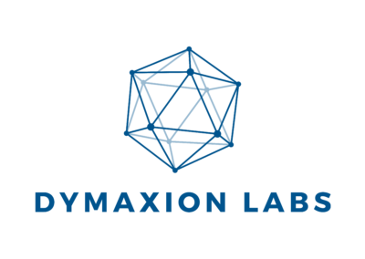
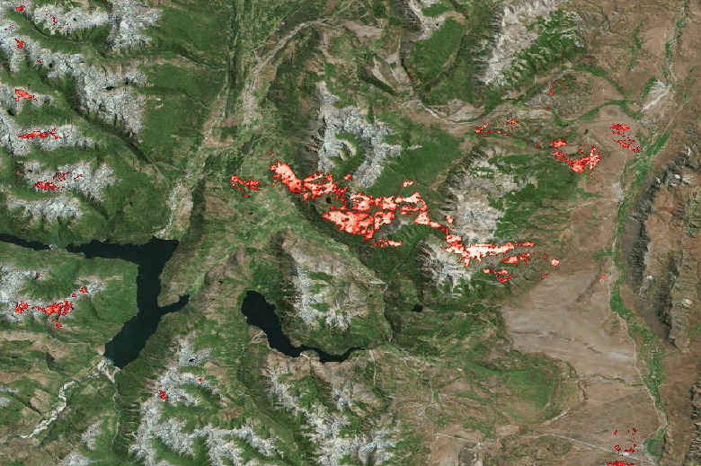
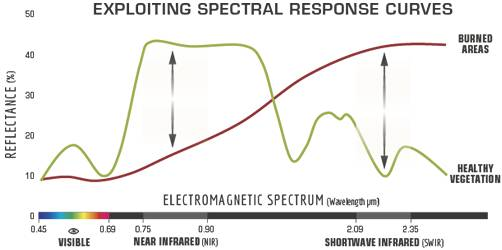

*This digital tool is part of the catalog of tools of the **Inter-American Development Bank**. You can learn more about the IDB initiative at [code.iadb.org](https://code.iadb.org/en)*

  

  #  burned-area-detection  
  

 

Detection of burned areas using deep learning from satellite images.

  

##  Description

The burned-area-detection project aims to identify and analyze the affected
areas after a fire incident. It allows us to understand incident behavior to
take action shortly.

The number of uncontrolled fires has increased significantly in the last few
years. This kind of environmental catastrophe affects habitat and community on
several levels. The impact on our environment can be evidenced in a short time
by measuring the wellness and the evacuation process of the different
communities living in affected areas. But we are also able to notice its
effects in the long term due to the impact on nature and local economies. Some
of the project's principal goals are measuring these affected areas. 

This project uses Sentinel-2 public satellite images. Sentinel-2 has high
cadence at no cost, allowing the study of the affected area's evolution across
time. These images can be download from Google Earth Engine. There are several
reflectance bands available to use, besides a combination of them can be more
sensitive to detect burn areas.

### Normalized Burn Ratio (NBR)

The Normalized Burn Ratio (NBR) is an index that highlights burnt areas in
large fire zones. The formula combines the near-infrared (NIR) and shortwave
infrared (SWIR) wavelengths.

Healthy vegetation shows a very high reflectance in the NIR, and low
reflectance in the SWIR portion of the spectrum, (see figure below). The
contrary happens for areas destroyed by fire; recently burnt areas show a low
reflectance in the NIR and high reflectance in the SWIR. Therefore, the
normalized difference between the NIR and the SWIR is a good discriminant for
this kind of phenomenon.

  

### Burn Severity

The difference between the pre-fire and post-fire NBR obtained from the images
is used to calculate the delta NBR. A higher value of dNBR indicates more
severe damage, while areas with negative dNBR values may indicate regrowth
following a fire.

Uses [satproc](https://github.com/dymaxionlabs/satproc) and
[unetseg](https://github.com/dymaxionlabs/unetseg) Python packages.

## 	:notebook: Notebooks

This repository contains a set of Jupyter Notebooks describing the steps for
building a semantic segmentation model based on the U-Net architecture for
detecting burned areas from fires from optical satellite imagery.

1. [Pre-process](1_Pre-process.ipynb): Image and ground truth data preprocessing and dataset generation
2. [Training](2_Training.ipynb): Model training and evaluation
3. [Prediction](3_Prediction.ipynb): Prediction
4. [Post-process](4_Post-process.ipynb): Post-processing of prediction results

##  About Dymaxion Labs
We are a company that seeks to better understand the engines of economic development in Latin America. [DYMAXION LABS](https://dymaxionlabs.com/) was designed: 100% digital, 100% software and 100% cloud; to contribute with a positive use of technology and in this way solve the most complex problems on a planetary scale.

## :handshake: Contributing

Bug reports and pull requests are welcome on GitHub at the [issues
page](https://github.com/dymaxionlabs/burned-area-detection). This project is
intended to be a safe, welcoming space for collaboration, and contributors are
expected to adhere to the [Contributor
Covenant](http://contributor-covenant.org) code of conduct.

## :page_facing_up: License

This project is licensed under Apache 2.0. Refer to [LICENSE.txt](LICENSE.txt).
